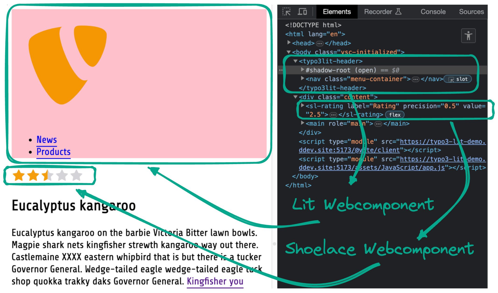

# TYPO3 Lit Demo

- Demo how to scaffold Lit Web Components as building blocks for a TYPO3 frontend
- Based on GitLab TYPO3 Distribution



## Quickstart

Use this command to set up the template

 * `ddev typo3-init`

## All commands - manual setup

Configure ddev, install packages and start the ddev instance:

```
ddev start
ddev composer install
ddev typo3 setup
```

Prepare and build frontend:

```
ddev npm install
ddev npm run build:production
```

Initialize data (page tree and link assets):

```
ddev typo3 extension:setup
ddev composer dumpautoload
```

## Use Vite.js [dev server for ddev](https://github.com/torenware/ddev-viteserve#getting-started)

```
ddev get torenware/ddev-viteserve
ddev restart
ddev vite-serve start
```

## Files and folders

The folder `packages` contains all your local extension/packages.
Require these packages simply by using `composer req vendor/package:@dev`

`assets` contains all scss, javascript, images and fonts which will be processed
by [Vite.js](https://vitejs.dev/) and stored in `packages/site-distribution/Resources/Public/`.

## Npm Scripts / Vite.js

The frontend toolchain uses NPM and Vite.js with a few loaders to ...
  * Compile Css to css (`assets/Css`)
  * Bundle javascript (`assets/JavaScript`)
  * Copy images (`assets/Image`) and fonts (`assets/Fonts`) to the Public folder of EXT:site-distribution

Watch for changes in js/css files:
```
npm run watch
```

Build JS, CSS for development use (not compressed/optimized):
```
npm run build:development
```

Build JS, CSS for production use:
```
npm run build:production
```

## Lit web components

Stored in *packages/site-distribution/Resources/Public/Components*

```html
<typo3lit-header> <!-- ... --> </typo3lit-header>
```
## Shoelace web components

Imported in *assets/JavaScript/app.js*

```html
    <sl-button href="#">Link Button</sl-button>
```

## Documentation

  * TYPO3 - https://docs.typo3.org/
  * DDEV - https://ddev.readthedocs.io/en/stable/
  * Vite AssetCollector - https://github.com/s2b/vite-asset-collector/tree/main
  * Vite - https://vitejs.dev/
  * LightningCSS - https://lightningcss.dev/
  * Lit - https://lit.dev/docs/
  * Shoelace https://shoelace.style/

